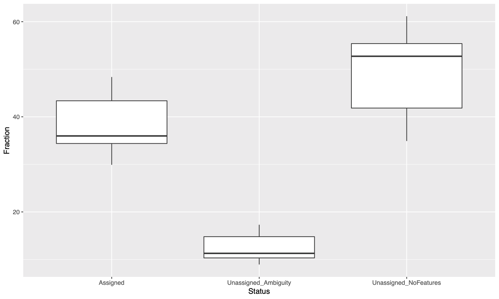
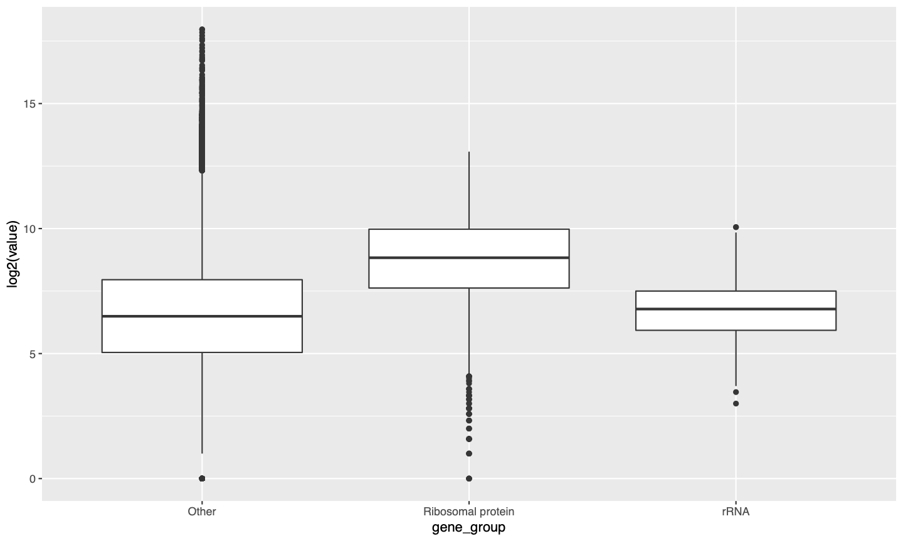
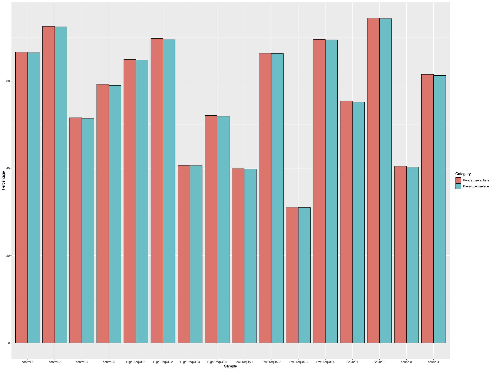

Background
==========

Here I divide this code into three parts:  
1- multimapped reads  
2- rRNA  
3- Evaluation of XenofilteR with MM\_treshold to assign the reads
followed by QoRTs

Multimapped reads
-----------------

From STAR log.final.out we can check proportion of reads mapped in
different categories:

% of Uniquely mapped reads % of reads mapped to multiple loci  
% of reads unmapped: too many mismatches  
% of reads unmapped: too short  
% of chimeric reads

### Exploring content of multimapped reads

#### Gene Expression

First we extract multimapped reads:

Then by using newly generated bam files, consisting of only multimapped
reads, I extracted expression values by tweaking default parameters in
featurecounts: - No cut-off for mapping quality  
- Only count read pairs that have both ends aligned (-B)  
- Multi-mapping reads will also be counted. For a multimapping read, all
its reported alignments will be counted. The ‘NH’ tag in BAM/SAM input
is used to detect multi-mapping reads (-M)

We create expression file for each file:

Check the freq of multimapped reads featurecounts output:

``` r
library(ggplot2)
library(reshape2)
library()
path <- '~/SMS_5221_20_SounDrivenBiotechnology/'
samples <- read.table(paste0(path,'code/Samples_reads.txt'))
colnames(samples)[1] <- 'Sample'

FC_summary <- data.frame(Status = c( "Assigned", "Unassigned_Unmapped", "Unassigned_Read_Type", "Unassigned_Singleton", "Unassigned_MappingQuality", "Unassigned_Chimera", "Unassigned_FragmentLength", "Unassigned_Duplicate", "Unassigned_MultiMapping", "Unassigned_Secondary", "Unassigned_NonSplit", "Unassigned_NoFeatures", "Unassigned_Overlapping_Length", "Unassigned_Ambiguity"))

for (i in 1:nrow(samples)){
  tmp_summary <- read.table(paste0(path, 'intermediate//featureCounts/STAR_chromosome_level_Trimmed/',samples$Sample[i], '/count-s-2.summary'), header = T)
  FC_summary[,as.character(samples$Sample[i])] <- tmp_summary[,2]*100/sum(tmp_summary[,2])
}
FC_summary <- FC_summary[(rowSums(FC_summary[,2:ncol(FC_summary)]) >0),]
FC_summary_melt <- melt(FC_summary)
colnames(FC_summary_melt) <- c('Status', 'Sample', 'Fraction')
pdf(paste0(path,'/intermediate//featureCounts/STAR_chromosome_level_Trimmed/Multimapped_featurecount_summary_dist.pdf'), width = 10 ,height = 6)
ggplot(data = FC_summary_melt, aes(x = Status, y = Fraction)) + geom_boxplot()
dev.off()
```


<p class="caption">
FeatureCounts summary distribution of all samples.
</p>

40% of the multimapped reads are assigned to genes while \~60% are
unassigned feature. I start by dissecting the expression of ribosomal
protein, rRNA among “assigned\_features”.  
First, I merge individual runs of featurecounts:

``` r
path <- '~/SMS_5221_20_SounDrivenBiotechnology/'
samples <- read.table(paste0(path, 'code/Samples_reads.txt'))
colnames(samples) <- c('Sample', 'R1', 'R2')
cntr <- 1

for(s in samples$Sample){
  tmp_featurecounts <- read.table(paste0(path, 'intermediate/featureCounts/STAR_chromosome_level_Trimmed/',s,'/count-s-2'), header = T, skip = 1)
  if(cntr == 1){
    data_raw <- data.frame(tmp_featurecounts[,1], matrix(0,nrow=, nrow(tmp_featurecounts), ncol=nrow(samples), byrow = T))
    colnames(data_raw) <- c('gene_id',as.character(samples$Sample))
  }
  data_raw[, as.character(s)] <- tmp_featurecounts[,7]
  cat('\r', paste0(cntr,": ", as.character(s)))
  cntr <- cntr + 1
}
write.table(data_raw, paste0(path,'intermediate/featureCounts/STAR_chromosome_level_Trimmed/merged_gene_counts.txt'), col.names = T, row.names = F, quote = F, sep = '\t')
```


<p class="caption">
Gene expression distribution in three categories: ribosomal proteins,
rRNA, and the rest (other)
</p>

It seems that a large number of reads have been multi-mapped on
ribosomal protein and rRAN and the average expression is similar to rest
of the genes.

rRNA
----

First I extracted rRNA information from annotation file. One could
directly extract extract sequences from gff but my aim is to keep track
of coordinate for visualisation as well.

``` bash
grep -v  "#"  GCF_000149955.1_ASM14995v2_genomic.gff | awk '($3 == "gene"){OFS="\t";print $1,$4-1,$5,$7,$9}' | sed 's/ID=gene-//'  | sed 's/;.*gene_biotype=/\t/' | sed 's/;.*//' >GCF_000149955.1_ASM14995v2_genomic_bui_type.bed
awk '($6 == "rRNA"){print $0}'  GCF_000149955.1_ASM14995v2_genomic_biotype.bed >GCF_000149955.1_ASM14995v2_rRNA.bed
k '{print "samtools faidx ../reference/genome.fa \""$1":"$2"-"$3"\""}' GCF_000149955.1_ASM14995v2_rRNA.bed | sh >GCF_000149955.1_ASM14995v2_rRNA.fa
```

We can also check the presence of rRNA in raw reads by bbduk.

``` bash
ribo_referene="GCF_000149955.1_ASM14995v2_rRNA.fa"
bbduk.sh \
in=$TRIMMED_READS/$sample/${sample}_R1_paired.fq.gz \
in2=$TRIMMED_READS/$sample/${sample}_R2_paired.fq.gz \
outm=ribo.fa ref=$ribo_referene \
qhist=qhist \
aqhist=aqhist \
lhist=lhist \
gchist=gchist \
rpkm=rpkm \
stats=stats \
1>err 2>${sample}_bbduk.txt
```

    ## Using Sample as id variables

    ## quartz_off_screen 
    ##                 2


<p class="caption">
bbduk results. Proportion of reads and bases showing high similarity to
the refernce (rRNA).
</p>

Between 40 and 60% of the reads seem to be rRNA.

Evaluation of XenofilteR
------------------------
